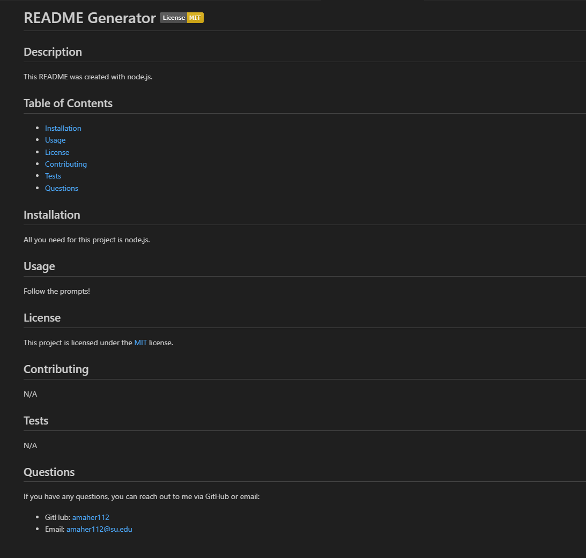

# README Generator

## Description
This project walks a user through the process of creating a README via node.js. The application asks the user for information on all relevent topics that should be included in a professional README, takes that information and creates a markdown file. The application also includes a license badge based on user input, as well as creates a link to the license information.

## Usage
Here is the link to the walk-through video: 
https://drive.google.com/file/d/1GBVb8GWYeJPTZadzC9v_ugEbPfoOFcAP/view

